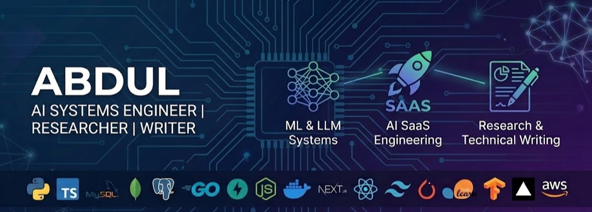

---

<h1 align="left">
  🫧Hello 
</h1>

  

  

  

# 🫧 Expertise

  

- 🚀AI system design and development
- 💰SaaS product engineering
- 📈Market Research and Data Analytics
- 📝Academic and Technical Writing
- 🧩Strategic and Business Consulting

---
# 🫧 Tech Stack

  
   Python &nbsp;&nbsp;
   TypeScript &nbsp;&nbsp;
   MySQL &nbsp;&nbsp;
   MongoDB &nbsp;&nbsp;
   PostgreSQL &nbsp;&nbsp;
   Go &nbsp;&nbsp;
   FastAPI &nbsp;&nbsp;
   Node.js &nbsp;&nbsp;
   Docker &nbsp;&nbsp;
   Next.js &nbsp;&nbsp;
   HTML &nbsp;&nbsp;
   React &nbsp;&nbsp;
   Tailwind CSS &nbsp;&nbsp;
   PyTorch &nbsp;&nbsp;
   Scikit-Learn &nbsp;&nbsp;
   TensorFlow &nbsp;&nbsp;
   Vercel &nbsp;&nbsp;
   AWS

---

# 🫧 What I've Been Building

  

--

🫟🎯ACHIEVIT: An Adaptive LLM Academic Planning System powered by Gemini-3

👉[Click to view app](https://achievit.streamlit.app/)

--

🫟🎭CaptAI: A dual ML-powered sentiment analysis system

👉[Click to view app](https://captai.streamlit.app/)

--

🫟💳FinRisk-ML: A ML-powered Transaction risk analysis system

👉[Click to view app](https://finrisk-ml.streamlit.app/)

--

  

  

---
# 🫧Dev Stats

  

  

---
# 🫧Articles, Documentations & Publications

  

📒[Techncal Docs](https://app.box.com/s/cz06kwa8m8dznlqi2tlah0ul5p7glx1c)

📚[Writing Gig Samples](https://app.box.com/s/hogbrxaw7m5wd9zeshmob7dyalte0b91)

---

# 🫧 Connect With Me

I can help/collaborate with you on:

  

  
  &nbsp;
  
  &nbsp;
  
  &nbsp;

  

