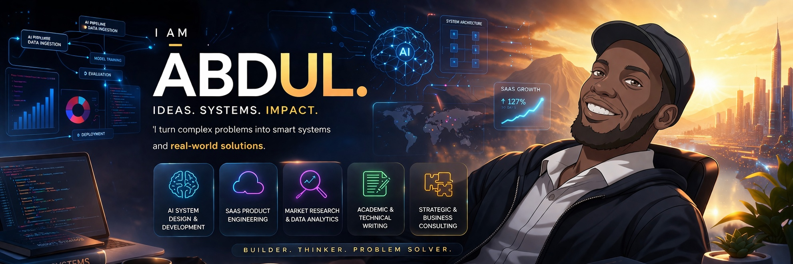

  

  

  

---

  

My Expertise and works revolve around:
- 🚀 AI System Design and Development
- 💰 SaaS Product Engineering
- 📈 Market Research and Data Analytics
- 📝 Technical Writing
- 🧩 Strategic and Business Consulting

---

  

Stacks that I use

  

  
  
  
  
  

---

🚀

  

  

> - 📟 Crea8it: a vertical EdTech SaaS for product building, distribution, and tech-career development.
> - 💰Lifetime Revenue: N53.5k

  

--

  

> - 📈 StaX360: A modular no-code statistical analysis platform for rapid research and data analysis— boosting productivity and reduce analysis time by ~80%. 

  

--

  

> - 📒 BizTrack-OS: A modular Smart Business App for SMEs in managing inventory, trackimg sales, generating invoice, tracking debtors, and monitoring business performance growth
> - 💰 Lifetime Revenue: N9k

  

---

  Check Repo for more projects👇

  

---

  

  
  
  

---

  

📢Explore the Build Experience and Lessons I'm Documenting and Sharing Publicly

&nbsp;
&nbsp;
&nbsp;
&nbsp;

---

  

I can help/collaborate with you on:

  

  
  &nbsp;
  
  &nbsp;
  
  &nbsp;
  

---

